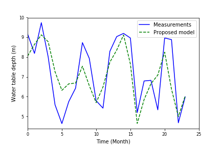

# Water-Table-Depth-Prediction-Pytorch

### Introduction
This is a PyTorch implementation of my Hydrological Modeling course project at IIIT-Hyderabad, i.e., *Developing a Long Short-Term Memory (LSTM) based Model for Predicting Water Table Depth in Agricultural Areas*.

### Requirements
```
Python3.x
pytorch>=0.4.0
numpy>=1.14.0
pandas>=0.22.0
scikit-learn>=0.14
```
### Installation
The code was tested with Python 3.5. To use this code, please do:


	Install dependencies:
    ```Shell
    pip install matplotlib numpy pandas scikit-learn
    ```
    For pytorch installation, please see in [PyTorch.org](https://pytorch.org/).
  


If installed and run correctly, the result should look like this:

